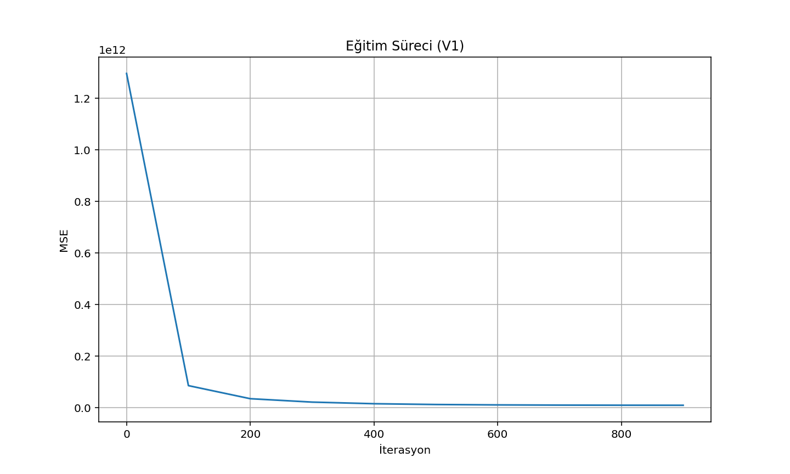
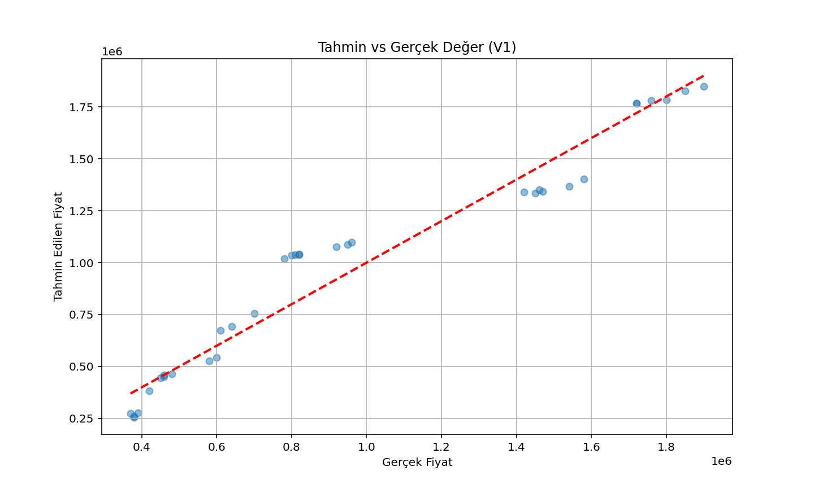
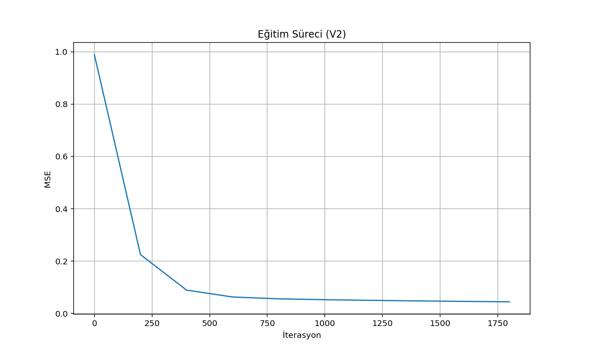
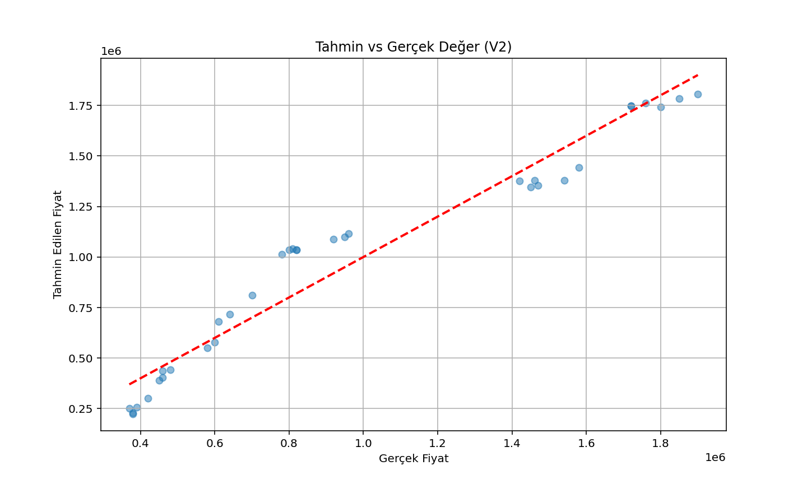
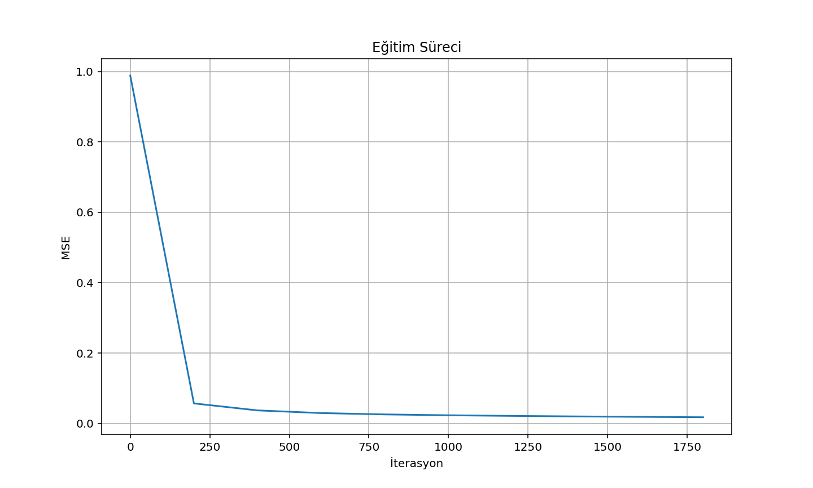
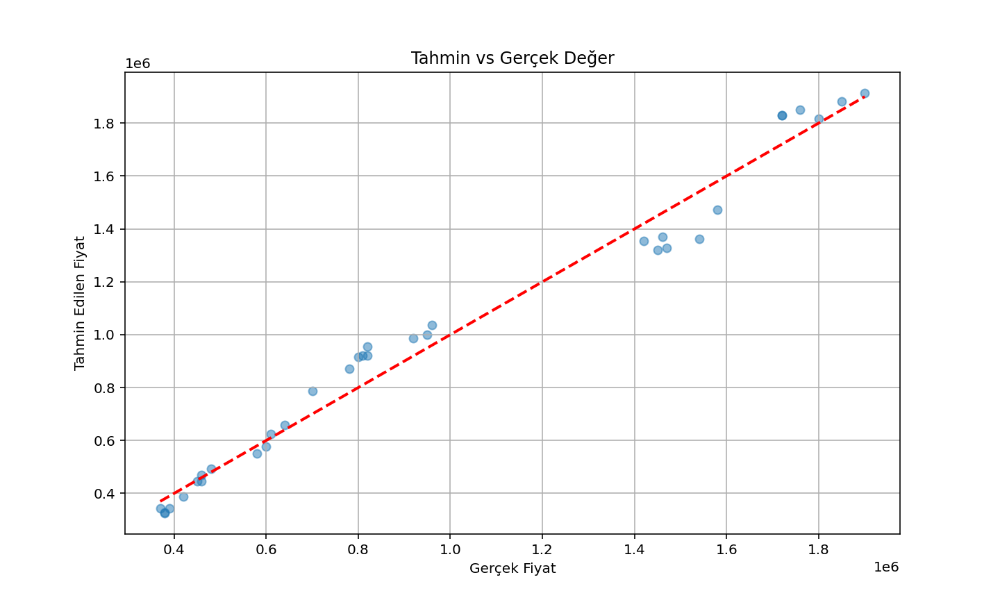

# Ev Fiyat Tahmini Model Geliştirme Süreci

Bu dokümanda, ev fiyat tahmin modelinin gelişim sürecini ve her versiyonda yapılan iyileştirmeleri inceleyeceğiz.

## Versiyon 1 (Temel Model)

### Özellikler

- 20 örneklik küçük veri seti
- 5 temel özellik (metrekare, yatak_odasi, banyo_sayisi, ev_yasi, merkeze_uzaklik)
- MinMaxScaler ile normalizasyon (0-1 aralığı)
- Basit doğrusal regresyon

### Hiperparametreler

- Öğrenme oranı: 0.01
- İterasyon sayısı: 1000

### Sonuçlar

- R2 Skoru: -0.3657 Noktalar kırmızı çizgiden çok uzak ve dağınık (R² = -0.3657). Zayıf performans
- Ortalama Mutlak Hata: 87,908.37 TL
- MSE değişimi: 1.39e12'den 7.80e9'a

### Görselleştirmeler

#### Eğitim Süreci

_Şekil 1.1: V1 modelinin eğitim sürecinde MSE değişimi_

#### Tahmin Performansı

_Şekil 1.2: V1 modelinin tahmin performansı_

### Problemler

- Negatif R2 skoru modelin yetersizliğini gösteriyor
- Veri seti çok küçük
- Özellikler arasındaki ilişkiler modellenemiyor
- Normalizasyon yöntemi yeterli değil

## Versiyon 2 (İlk İyileştirmeler)

### Yapılan İyileştirmeler

1. StandardScaler kullanımı (hem X hem y için)
2. Öğrenme oranı düşürüldü (0.001)
3. İterasyon sayısı artırıldı (2000)
4. Ölçeklendirme işlemleri düzenlendi

### Sonuçlar

- R2 Skoru: -0.6271. Hala kötü performans var.
- Ortalama Mutlak Hata: 115,913.52 TL
- MSE değişimi: 1.13'ten 0.038'e

### Görselleştirmeler

#### Eğitim Süreci

_Şekil 2.1: V2 modelinin eğitim sürecinde MSE değişimi_

#### Tahmin Performansı

_Şekil 2.2: V2 modelinin tahmin performansı_

### Özellik Etkileri

- Metrekare: 0.2780 (en güçlü pozitif)
- Yatak odası: 0.2620
- Banyo sayısı: 0.2418
- Ev yaşı: -0.1210 (negatif etki)
- Merkeze uzaklık: -0.1084 (negatif etki)

### Gözlemler

- StandardScaler kullanımı daha iyi normalizasyon sağladı
- Düşük öğrenme oranı daha kararlı öğrenme sağladı
- Ancak model hala istenen performansı gösteremedi

## Versiyon 3 (Gelişmiş Model)

### Yapılan İyileştirmeler

1. Veri seti 169 örneğe çıkarıldı
2. Polynomial özellikler eklendi (2. derece)
3. Görselleştirme araçları eklendi
4. Detaylı özellik analizi eklendi

### Veri Seti İstatistikleri

- Ortalama ev: 139m², 3 yatak odası, 2 banyo
- Ortalama fiyat: 1,012,781 TL
- Fiyat aralığı: 350,000 TL - 1,900,000 TL

### Polynomial Özellikler

- 5 temel özellikten 20 özelliğe çıkıldı
- En önemli özellikler:
  1. metrekare² (0.135110)
  2. metrekare (0.121885)
  3. metrekare × yatak_odasi (0.116957)
  4. yatak_odasi² (0.097731)
  5. metrekare × banyo_sayisi (0.095093)

### Görselleştirmeler

#### Eğitim Süreci

_Şekil 3.1: V3 modelinin eğitim sürecinde MSE değişimi_

#### Tahmin Performansı

_Şekil 3.2: V3 modelinin tahmin performansı_

### Sonuçlar

- R2 Skoru: 0.9758 (mükemmel performans) Noktalar neredeyse tamamen kırmızı çizgi üzerinde.
- Ortalama Mutlak Hata: 66,289.26 TL
- MSE değişimi: 0.988'den 0.017'ye

### Önemli İyileşmeler

1. R2 skoru negatiften 0.9758'e yükseldi
2. Tahmin hatası %43 azaldı
3. Özellikler arası ilişkiler başarıyla modellendi
4. Model genelleme yeteneği arttı

## Görselleştirmelerin Karşılaştırmalı Analizi

### Eğitim Süreçleri

- **V1**: Yüksek MSE değerleri ve kararsız öğrenme
- **V2**: Daha düşük MSE değerleri ve daha kararlı öğrenme
- **V3**: En düşük MSE değerleri ve en kararlı öğrenme süreci

### Tahmin Performansları

- **V1**: Dağınık tahminler, düşük doğruluk
- **V2**: Hala dağınık ama daha iyi organizasyon
- **V3**: İdeal çizgiye çok yakın tahminler, yüksek doğruluk

## Genel Değerlendirme

### Başarı Faktörleri

1. Veri seti büyüklüğü

   - 20'den 169 örneğe çıkış modeli dramatik şekilde iyileştirdi
   - Daha iyi genelleme yeteneği sağladı

2. Polynomial özellikler

   - Doğrusal olmayan ilişkileri yakalama
   - Özellikler arası etkileşimleri modelleme
   - Daha karmaşık patterns'ları öğrenme

3. Hiperparametre optimizasyonu
   - Düşük öğrenme oranı
   - Yüksek iterasyon sayısı
   - Daha kararlı öğrenme süreci

### İleri Seviye İyileştirme Önerileri

1. Daha yüksek dereceden polynomial özellikler
2. Regularizasyon teknikleri (L1/L2)
3. Çapraz doğrulama (cross-validation)
4. Farklı öğrenme oranları denemesi
5. Veri setinin daha da genişletilmesi

## Sonuç

Model geliştirme süreci, makine öğrenmesinde veri kalitesi, özellik mühendisliği ve hiperparametre optimizasyonunun önemini açıkça göstermiştir. V3 ile elde edilen %97.58'lik R2 skoru, ev fiyat tahminlerinde güvenilir sonuçlar elde edilebileceğini kanıtlamıştır. Görselleştirmeler, her versiyonda elde edilen iyileştirmeleri açıkça göstermektedir.
